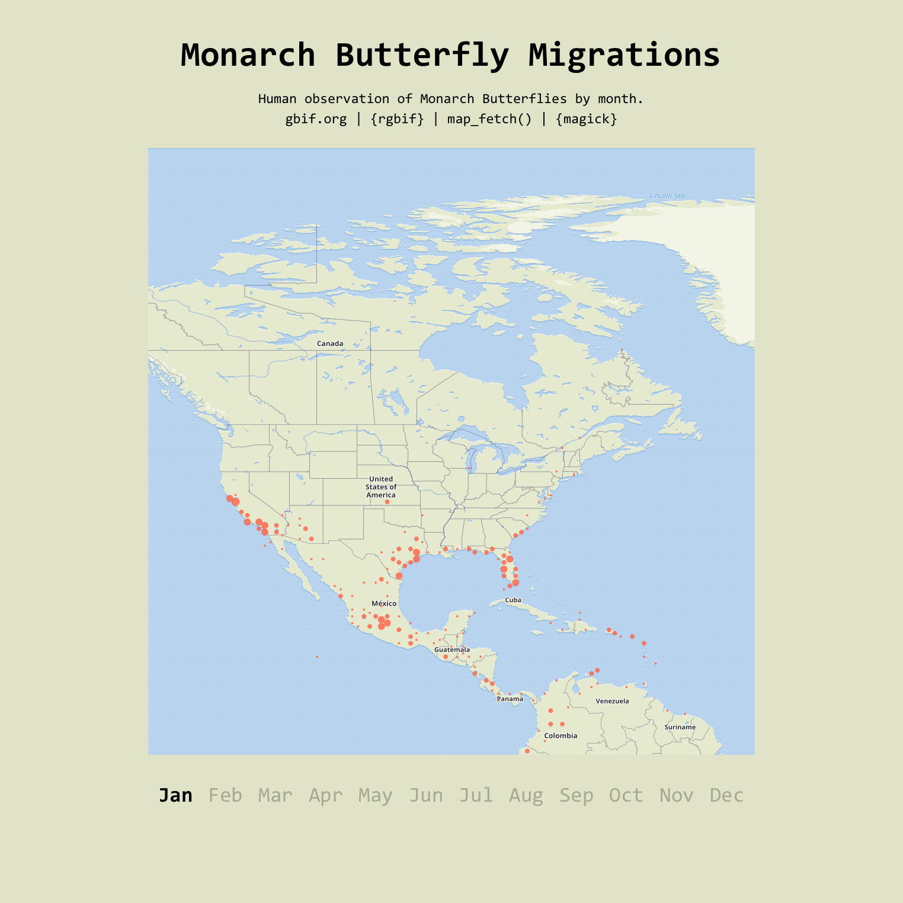
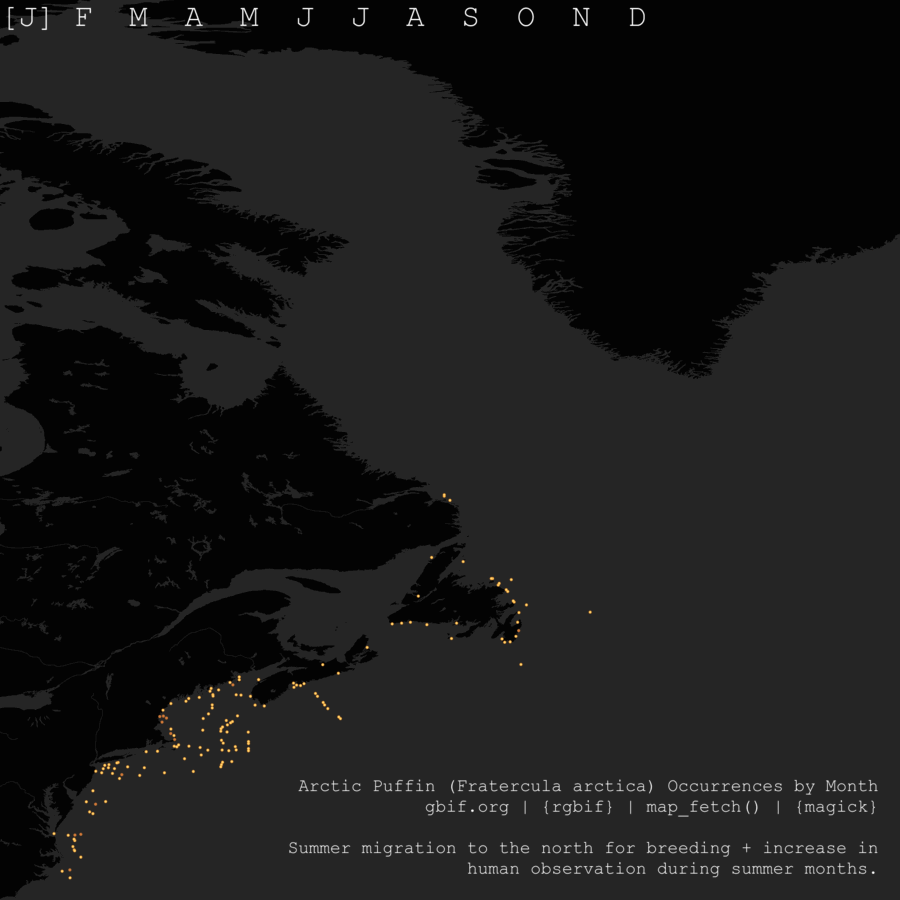

# GBIF
Data visualization with data from [GBIF](https://www.gbif.org).

***

## Nov. 2023 - [Monarch Butterfly Migration](monarchs/)

...another one, adding {ggplot} to create a map *base*, allowing for deeper customization of the text labels. See below for more notes on similar projects.

## Nov. 2023 - [Gray Whale Migration](graywhale/)

Second go with [map_fetch()](https://docs.ropensci.org/rgbif/reference/map_fetch.html) to fetch maps of [GBIF](www.gbif.org) data. This time with an animal known for its migration patterns.

## Nov. 2023 - [Puffins](puffins/)

This was my first attempt at using [map_fetch()](https://docs.ropensci.org/rgbif/reference/map_fetch.html) to fetch maps of [GBIF](www.gbif.org) data. I used the [{magick}](https://cran.r-project.org/web/packages/magick/vignettes/intro.html) package to annotate the maps and stitch them together in a .gif. I was originally interested in the .gif format to visualize migration patterns. While *Fratercula arctica* [does breed in the North Atlantic](https://www.audubon.org/field-guide/bird/atlantic-puffin), we should also consider that human observations increase in the warm summer months in that area as well. Puffins also spend winters farther out at sea, making human observation less likely.

## Nov. 2023 - [Mon[tree]al](montreeal/)

