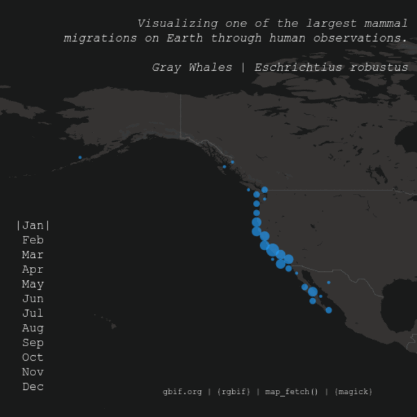

# Visualizing Gray Whale Migrations Through Human Observation
#### Created: 2023-11-18

Taking what I had learned through the [Puffin](/puffins) project and again relying on the [`rgbif`](https://github.com/ropensci/rgbif) and [`magick`](https://cran.r-project.org/web/packages/magick/vignettes/intro.html) packages. This time, using an animal with a known and notable migration pattern.

  

