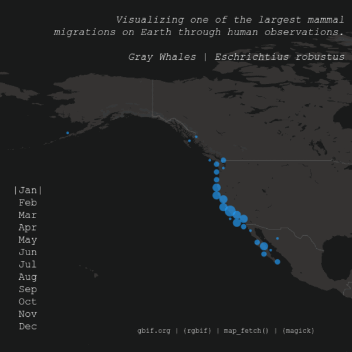

# Visualizing Gray Whale Migrations Through Human Observation
**Created:: 2023-11-18**


###### Packages: [`rgbif`](https://github.com/ropensci/rgbif) |  [`magick`](https://github.com/ropensci/magick)
###### Code:: [graywhale.R](graywhale.R)
###### Other Links: [GBIF](https://www.gbif.org) | [`map_fetch()`](https://data-blog.gbif.org/post/2023-03-24-maps-api/)

___
## Some Thoughts
Taking what I had learned through the [Puffin](/puffins) project and again relying on the `rgbif`and `magick` packages. This time, using an animal with a known and notable migration pattern.

Followed the same process as in [Puffins](/puffins): 
* Create maps for each month using `map_fetch()`
* Add annotations with `image_annotate()`
* Stich them altogether in a gif with `image_animate()`

### Visual Artifacts with `image_animate()`
Originally I had set `optimize = TRUE` within the final `image_animate()` function used to create the gif. I hadn't read the documentation fully and simply assumed I would want the gif to be "optimized", but turns out that `optimize` reduces the gif file size by storing only the differences between frames. While there is theoretically very little difference between the frames in this case (the only changes are the location of the observation markers and month annotation, leaving `optimize = TRUE` resulted in some subtle visual artifacts (watch at Feb. and Nov. specifically):

``` r
image_resize(year, '600') %>%
  image_animate(fps = 2, optimize = TRUE)
```



This results in a gif with a 152KB filesize. Setting `optimize` to `FALSE` removes these artifacts and results in a 344KB gif:

``` r
image_resize(year, '600') %>%
  image_animate(fps = 2, optimize = TRUE)
```


