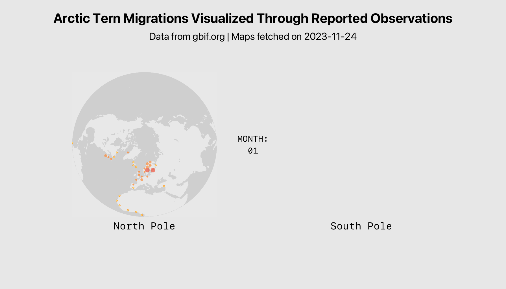
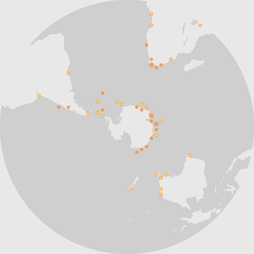

# Arctic Tern Migrations Visualized Through Reported Observations
**Created:: 2023-11-24**

![Visualizing for the Arctic Terns project showing two maps of the world. On the left we see the Earth from the north pole, and on the right we see it from the south pole. The gif animation cycles through the months of the year, and circles are displayed on each map to indicate the location and quantity of arctic tern observations. In the summer months, there are peaks in observations around the North Pole and across the northern hemisphere. During the winter months, observations appear more commonly in the southern hemisphere.](./terns.gif)

###### Packages: [`rgbif`](https://github.com/ropensci/rgbif) | [`magick`](https://github.com/ropensci/magick) | [`tidyverse` & `ggplot`](https://github.com/tidyverse) | [`cowplot`](https://github.com/wilkelab/cowplot)
###### Code:: [terns.R](./terns.R)
###### Other Links: [GBIF](https://www.gbif.org) | [`map_fetch()`](https://data-blog.gbif.org/post/2023-03-24-maps-api/)

___
## Some Thoughts
This project was influenced by previous work with the `rgbif` package and the `map_fetch()` function. For more details, refer to earlier projects:
- [Monarch Butterflies](/monarchs)
- [Gray Whales](/graywhale)
- [Arctic Puffins](/puffins)

Modeling the migrations of Arctic Terns (*Sterna paradisaea*), which notably spend the northern hemisphere summer in the northern hemisphere, and the winter in the southern hemisphere, was primarily an excuse to make use of the different spatial reference system (srs) options of `map_fetch()`, namely `EPSG:3575` (arctic) and `EPSG:3031` (antarctic). I admit this may not be the most useful approach to visualizing the data.

### Creating a base layer
As with the [Monarch](/monarchs) project, I used `ggplot` to create a base layer for the maps. I also leveraged `cowplot`'s `theme_nothing()` and [modified the axes to completely eliminate the plot margins](https://stackoverflow.com/questions/31254533/when-using-ggplot-in-r-how-do-i-remove-margins-surrounding-the-plot-area), giving me greater control of the exact size of the base layer. This made it easier to place the two maps later on.

I also set up a series of tibbles with the base layer aesthetics, allowing me to make global adjustments as needed.

``` r
#AESTHETICS
##base plot
###changes to these values will affect all base layers
rect <- tibble(xmin = 0,
               xmax = 1792,
               ymin = 0,
               ymax = 1024,
               fill = "#ececec")
title <- tibble(x = 896,
                y = 960,
                label = "Arctic Tern Migrations Visualized Through Reported Observations",
                family = "SF Pro Display",
                fontface = "bold",
                size = 4)
caption <- tibble(x = 896,
                  y = 896,
                  label = "Data from gbif.org | Maps fetched on 2023-11-24",
                  family = "SF Pro Display",
                  size = 3)
poles <- tibble(x = c(512,1280),
                y = 224,
                label = c("North Pole", "South Pole"),
                family = "SF Mono",
                size = 3)
month <- tibble(x = 896, 
                y = 512,
                jan_label = "MONTH:\n01",
                feb_label = "MONTH:\n02",
                mar_label = "MONTH:\n03",
                apr_label = "MONTH:\n04",
                may_label = "MONTH:\n05",
                jun_label = "MONTH:\n06",
                jul_label = "MONTH:\n07",
                aug_label = "MONTH:\n08",
                sep_label = "MONTH:\n09",
                oct_label = "MONTH:\n10",
                nov_label = "MONTH:\n11",
                dec_label = "MONTH:\n12",
                family = "SF Mono",
                size = 2.5)

#ggplot to make base layers
##jan
jan_base <- ggplot() +
  geom_rect(aes(xmin = rect$xmin, xmax = rect$xmax, ymin = rect$ymin, ymax = rect$ymax), 
            fill = rect$fill, 
            color = rect$fill) +
  geom_text(aes(x = title$x, y = title$y, label = title$label),
            family = title$family,
            fontface = title$fontface,
            size = title$size) +
  geom_text(aes(x = caption$x, y = caption$y, label = caption$label),
            family = caption$family,
            size = caption$size) +
  geom_text(aes(x = poles$x, y = poles$y, label = poles$label),
            family = poles$family,
            size = poles$size) +
  geom_text(aes(x = month$x, y = month$y, label = month$jan_label),
            family = month$family,
            size = month$size) +
  theme_nothing() +
  scale_x_continuous(expand=c(0,0)) +
  scale_y_continuous(expand=c(0,0)) +
  labs(x = NULL, y = NULL)


ggsave("jan_base.png", jan_base, width = 1792, height = 1024, units = "px")

jan_png <- image_read("jan_base.png")

###repeat for all other months, changing the label in the final geom_text accordingly
```


### Creating the maps
Two maps needed to be created for each month to visualize both the north and south poles. 

``` r
#create maps
##jan
jan_n <- map_fetch(srs = "EPSG:3575", #north pole
                 taxonKey = tern,
                 basisOfRecord = c("HUMAN_OBSERVATION", "MACHINE_OBSERVATION"),
                 source = "adhoc",
                 month = 1,
                 style = "scaled.circles",
                 base_style = "gbif-light",
                 bin = "hex")

jan_s <- map_fetch(srs = "EPSG:3031", #south pole
                   taxonKey = tern,
                   basisOfRecord = c("HUMAN_OBSERVATION", "MACHINE_OBSERVATION"),
                   source = "adhoc",
                   month = 1,
                   style = "scaled.circles",
                   base_style = "gbif-light",
                   bin = "hex")

##repeat for all motnhs
```

| jan_n | jan_s |
|------|------|
| |  |
### Joining the maps and base layers
Once all maps and base layers have been created. They can first be joined into single images, and then combined into a gif with `magick`.

``` r
#sitch maps and base together
jan_north <- image_composite(jan_png, jan_n, offset = "+256+256")
jan_final <- image_composite(jan_north, jan_s, offset = "+1024+256")

feb_north <- image_composite(feb_png, feb_n, offset = "+256+256")
feb_final <- image_composite(feb_north, feb_s, offset = "+1024+256")

mar_north <- image_composite(mar_png, mar_n, offset = "+256+256")
mar_final <- image_composite(mar_north, mar_s, offset = "+1024+256")

apr_north <- image_composite(apr_png,apr_n, offset = "+256+256")
apr_final <- image_composite(apr_north, apr_s, offset = "+1024+256")

may_north <- image_composite(may_png, may_n, offset = "+256+256")
may_final <- image_composite(may_north, may_s, offset = "+1024+256")

jun_north <- image_composite(jun_png, jun_n, offset = "+256+256")
jun_final <- image_composite(jun_north, jun_s, offset = "+1024+256")

jul_north <- image_composite(jul_png, jul_n, offset = "+256+256")
jul_final <- image_composite(jul_north, jul_s, offset = "+1024+256")

aug_north <- image_composite(aug_png, aug_n, offset = "+256+256")
aug_final <- image_composite(aug_north, aug_s, offset = "+1024+256")

sep_north <- image_composite(sep_png, sep_n, offset = "+256+256")
sep_final <- image_composite(sep_north, sep_s, offset = "+1024+256")

oct_north <- image_composite(oct_png, oct_n, offset = "+256+256")
oct_final <- image_composite(oct_north, oct_s, offset = "+1024+256")

nov_north <- image_composite(nov_png, nov_n, offset = "+256+256")
nov_final <- image_composite(nov_north, nov_s, offset = "+1024+256")

dec_north <- image_composite(dec_png, dec_n, offset = "+256+256")
dec_final <- image_composite(dec_north, dec_s, offset = "+1024+256")

#make .gif
year <- c(jan_final, feb_final, mar_final, apr_final, may_final, jun_final, jul_final, aug_final, sep_final, oct_final, nov_final, dec_final)
gif <- image_animate(year, fps = 2, optimize = TRUE)
image_write(gif, "terns.gif")
```

In order to place the maps in a specific location on the base layer, it is necessary to use `image_composite`, which is limited to composing only two images. Because of this, I needed to first compose the base layer with the north pole map:

`jan_north <- image_composite(jan_png, jan_n, offset = "+256+256")`



Then, I could compose the south pole map on top of this new image:

`jan_final <- image_composite(jan_north, jan_s, offset = "+1024+256")`


### Notes on the data
As with my other projects using `map_fetch()`, these maps represent a snapshot of observations at the time the maps were created from the GBIF database (`2023-11-24`). Using the code in the future will result in slightly different maps (although the pattern of migration should remain the same). 

For these maps, I also included machine observations in addition to human observations. This still disregards any observations of preserved specimens or captive animals. I thought machine observations might be more prevalent in certain areas, specifically around the south pole, where human observers are less likely. 

Running some examples shows that machine observations are more common in the open ocean, and human observations are more common near land. (using November, as it is a peak month for terns in the southern hemisphere):

``` r
nov_machine <- map_fetch(srs = "EPSG:3031",
                   taxonKey = tern,
                   basisOfRecord = c("MACHINE_OBSERVATION"),
                   source = "adhoc",
                   month = 11,
                   style = "scaled.circles",
                   base_style = "gbif-light",
                   bin = "hex")

nov_human <- map_fetch(srs = "EPSG:3031",
                   taxonKey = tern,
                   basisOfRecord = c("HUMAN_OBSERVATION"),
                   source = "adhoc",
                   month = 1,
                   style = "scaled.circles",
                   base_style = "gbif-light",
                   bin = "hex")
```

| nov_machine | nov_human |
|------------- | ------------ |
|  |  |

[Note that machine observations may include photographs taken by humans](https://docs.gbif.org/course-data-use/en/basis-of-record.html). 
